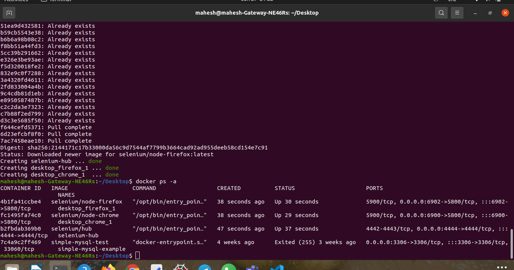
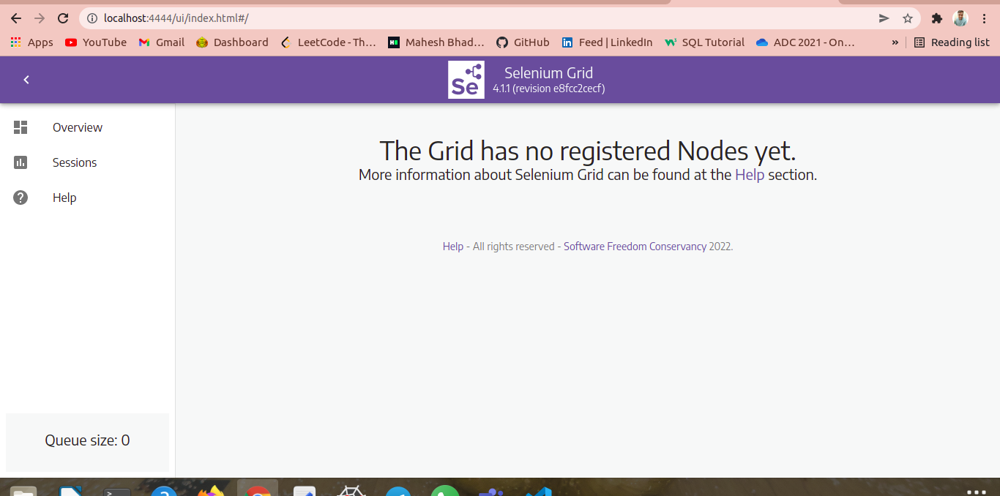

# Selenium-Hub-Grid-on-Docker-Compose

## Steps

1. Start your docker environment.

2. create a docker-compose file and then save it with the name "docker-compose.yml" .

3. Then run a simple command as given:

   docker-compose up -d 

  This will create a selenium hub with a chrome and firefox node.

